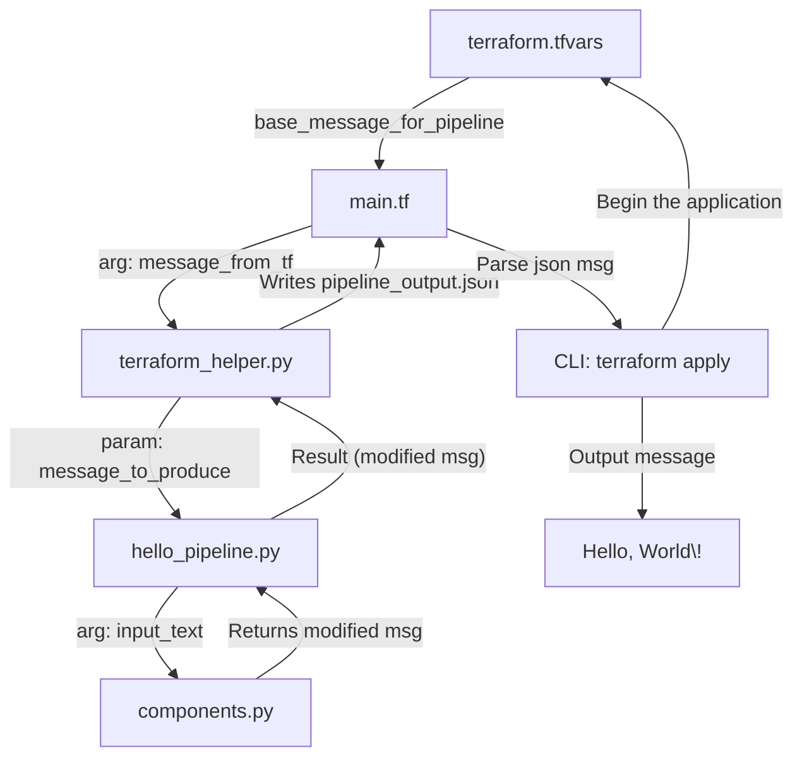

# Terraform & Vertex AI "Hello World" - Part 1 Example

This repository contains the example code for **Part 1** of the "Marketing to Machine Learning" blog series, demonstrating a minimal "Hello, World!" implementation using Terraform to orchestrate a Kubeflow Pipeline (KFP) on Google Cloud Vertex AI.

The goal of this specific example ("Example #3" from the blog post) is to show how Terraform can define, trigger, and retrieve output from a simple Vertex AI Pipeline, which in turn prints "Hello, World!" with a small addition from a KFP component.

## Blog Series Context

This series aims to demystify MLOps data pipelines for marketing data analysis.
*   **Part 1 (This Example):** Terraform & Vertex AI "Hello World" - Syntax and first principles.
*   **Part 2 (Forthcoming):** More complex pipelines, data ingestion, model training (e.g., "vai-basic").
*   **Part 3 (Forthcoming):** Exploring commercial solutions like Adswerve's AnDY (Analytics Delivered to You!) and Google's open-source Marketing Analytics Jumpstart (MAJ).

## Prerequisites

Before you begin, ensure you have the following installed and configured:

1.  **Google Cloud SDK (gcloud CLI):** [Installation Guide](https://cloud.google.com/sdk/docs/install)
    *   Authenticated with Google Cloud: `gcloud auth application-default login`
    *   Default project set: `gcloud config set project YOUR_GCP_PROJECT_ID` (replace `YOUR_GCP_PROJECT_ID`)
2.  **Terraform:** [Installation Guide](https://developer.hashicorp.com/terraform/tutorials/aws-get-started/install-cli) (version ~1.0 or higher recommended)
3.  **Python 3:** (version 3.8+ recommended)
    *   Pip (Python package installer)
    *   Venv (for creating virtual environments)
4.  **Git:** For cloning this repository.
5.  **(Optional but Recommended) A Google Cloud Project:** With billing enabled. You can use the Google Cloud Free Tier and sign-up credits. You will need Admin access or sufficient permissions to enable APIs and create resources (Vertex AI, Cloud Storage, IAM).

## Variable Flow
How does "Hello, World!" make it from the `terraform.tfvars` to a VAI Pipeline and back?


## Project Structure
```
./
├── pipeline
│ ├── init.py
│ ├── components.py
│ └── hello_pipeline.py
├── main.tf
├── requirements.txt
├── terraform_helper.py
└── terraform.tfvars
```

## Setup Instructions

1.  **Clone the repository (if you haven't already):**
    ```bash
    git clone https://github.com/iampatgrady/terraform-vertexai-helloworld.git
    cd terraform-vertexai-helloworld # Or your repository's directory name
    ```

2.  **Configure GCP Project ID:**
    Open the `terraform.tfvars` file and replace `your-gcp-project-id` with your actual Google Cloud Project ID:
    ```hcl
    // terraform.tfvars
    project_id                = "YOUR_ACTUAL_GCP_PROJECT_ID"
    base_message_for_pipeline = "Hello from Terraform to KFP (Example #3)!"
    ```

3.  **Set up Python Virtual Environment & Install Dependencies:**
    It's highly recommended to use a virtual environment.
    ```bash
    python3 -m venv .env
    source .env/bin/activate  # On Windows: .env\Scripts\activate
    pip install -r requirements.txt
    ```

4.  **Initialize Terraform:**
    This downloads the necessary providers.
    ```bash
    terraform init
    ```

## Running the Example

1.  **Apply the Terraform Configuration:**
    This will:
    *   Enable necessary Google Cloud APIs.
    *   Create a Google Cloud Storage bucket for pipeline artifacts.
    *   Execute the `terraform_helper.py` script, which:
        *   Compiles the KFP pipeline.
        *   Submits the pipeline to Vertex AI.
        *   Waits for the pipeline to complete.
        *   Retrieves the output message.
    *   Display the output message from the pipeline.

    ```bash
    terraform apply
    ```
    Review the plan and type `yes` when prompted.

2.  **Observe the Output:**
    After a successful apply (which might take a few minutes for the Vertex AI pipeline to run), you should see output similar to:
    ```
    Outputs:

    pipeline_artifacts_gcs_bucket = "gs://kfp-root-your-project-id-xxxxxxxx"
    vertex_ai_pipeline_output_message = "Hello from Terraform to KFP (Example #3)! - from KFP component"
    ```
    The "Hello, World!" (or your custom message) comes from Vertex AI Pipelines!

3.  **View in Google Cloud Console (Optional):**
    *   Navigate to [Vertex AI > Pipelines](https://console.cloud.google.com/vertex-ai/pipelines) in the Google Cloud Console.
    *   Select your project and region.
    *   You should see a pipeline run named similar to `KFP Run - xxxxxxxx`. Click on it to see the graph and component details.

## Cleaning Up

To remove all resources created by this Terraform configuration, run:
```bash
terraform destroy
```

Type `yes` when prompted. This will delete the GCS bucket and any other associated resources.

## Key Learnings from this Example

* Using Terraform to manage Google Cloud resources (APIs, GCS Bucket).  
* Orchestrating a serverless KFP pipeline on Vertex AI using a Python helper script triggered by Terraform (`null_resource` with `local-exec`).  
* Passing parameters from Terraform into a KFP pipeline.  
* Retrieving output from a KFP pipeline back into Terraform.  
* Using file hashes in Terraform `triggers` to re-run scripts when Python code changes.

## Next Steps

Check out the blog post for a detailed walkthrough and stay tuned for Part 2 of the series\!

*(Link to your blog post when it's live)*

---

*Inspired by and on the backs of Carlos Timoteo, Nick Feller, Tyrone Schiff, and Anže Kravanja.*


